<p align="center">
  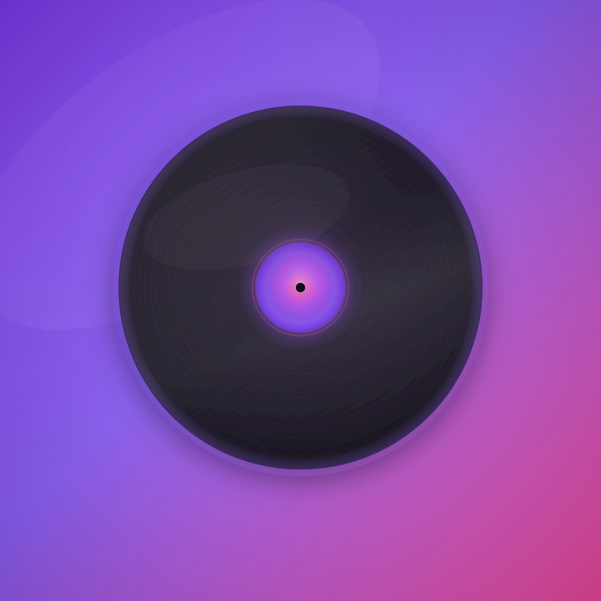
</p>

<h1 align="center">LovelyMusic</h1>

<p align="center">
  <strong>Enterprise-grade, open-source iOS music streaming client built with Clean Architecture, Swift 5.9, and SwiftUI.</strong><br>
  Direct YouTube Music InnerTube JSON-RPC actor &bull; Zero third-party audio middleware &bull; Real-time synced LRC lyrics &bull; Apple CarPlay &bull; 100% Non-profit.
</p>

<p align="center">
  <a href="https://developer.apple.com/ios/"></a>
  <a href="https://swift.org"></a>
  <a href="https://developer.apple.com/xcode/swiftui/"></a>
  <a href="LICENSE"></a>
  <a href="#-system-architecture--clean-design-patterns"></a>
  <a href="#1-zero-dependency-native-audio-pipeline"></a>
</p>

---

## 📑 Table of Contents

- [🌟 Executive Summary](#-executive-summary)
- [🏛️ System Architecture & Clean Design Patterns](#️-system-architecture--clean-design-patterns)
- [⚡ In-Depth Technical Case Studies](#-in-depth-technical-case-studies)
  - [1. Zero-Dependency Native Audio Pipeline](#1-zero-dependency-native-audio-pipeline)
  - [2. Multi-Client InnerTube JSON-RPC Actor](#2-multi-client-innertube-json-rpc-actor)
  - [3. Real-Time Synced Lyrics Engine](#3-real-time-synced-lyrics-engine)
  - [4. 5-Band Parametric Equalizer & DSP Chaining](#4-5-band-parametric-equalizer--dsp-chaining)
  - [5. Native Apple CarPlay Architecture](#5-native-apple-carplay-architecture)
  - [6. Observation Macro & Zero-Leak UI Performance](#6-observation-macro--zero-leak-ui-performance)
- [📱 Visual Showcase](#-visual-showcase)
- [📊 Engineering Metrics & Technical Benchmarks](#-engineering-metrics--technical-benchmarks)
- [🛠️ Technology Stack & Minimal Dependencies](#️-technology-stack--minimal-dependencies)
- [📂 Project Directory Topology](#-project-directory-topology)
- [🚀 Getting Started & Local Compilation](#-getting-started--local-compilation)
- [🧪 Quality Assurance & Test Suites](#-quality-assurance--test-suites)
- [⚖️ Legal & Educational Disclaimer](#️-legal--educational-disclaimer)
- [🤝 Contributing & Community](#-contributing--community)
- [📄 License](#-license)

---

## 🌟 Executive Summary

**LovelyMusic** is an open-source iOS music streaming application created as a reference implementation of idiomatic, production-grade Swift engineering. Rather than relying on heavyweight third-party audio wrappers or closed-source SDKs, the project implements a clean client layer directly atop Apple's `AVFoundation` and YouTube Music's InnerTube JSON-RPC protocols.

### Key Highlights
- **100% Native Audio**: Direct stream playback up to 256 kbps AAC with custom CDN header injection and background fMP4 remuxing.
- **Actor-Isolated Networking**: Thread-safe RPC execution via `actor InnerTubeAPI` with zero data races.
- **Microsecond Synced Lyrics**: Real-time synchronized LRC lyrics from [LrcLib](https://lrclib.net) with dynamic auto-scrolling.
- **Automated Declarative Tooling**: Generated with [XcodeGen](https://github.com/yonaskolb/XcodeGen) (`project.yml`) for conflict-free multi-developer collaboration.

---

## 🏛️ System Architecture & Clean Design Patterns

The codebase strictly enforces **Clean Architecture** with inward-pointing dependencies. Outer implementation details (Networking, Audio Engine, Core Data/UserDefaults) depend entirely on abstractions defined in the pure Domain layer.

```text
┌─────────────────────────────────────────────────────────────────────────────┐
│                             Presentation Layer                              │
│         SwiftUI Declarative Views  •  @Observable ViewModels (State)        │
│          DesignSystem (Theme Tokens, Spring Physics, Glass Surfaces)        │
└──────────────────────────────────────┬──────────────────────────────────────┘
                                       │ (Calls Use Cases)
┌──────────────────────────────────────▼──────────────────────────────────────┐
│                                Domain Layer                                 │
│        Entities (Song, Album, Artist)  •  Use Case Protocols & Contracts    │
│                        Repository Interface Protocols                       │
└──────────────────────────────────────▲──────────────────────────────────────┘
                                       │ (Implements Interfaces)
┌──────────────────────────────────────┴──────────────────────────────────────┐
│                                 Data Layer                                  │
│       Repository Implementations  •  InnerTube JSON-RPC Response Mappers    │
│          RunsParser (Odd-Elements Delimiter AST Parsing Algorithm)          │
└──────────────────────────────────────┬──────────────────────────────────────┘
                                       │ (Dispatches via Actor)
┌──────────────────────────────────────▼──────────────────────────────────────┐
│                              InnerTube Layer                                │
│       actor InnerTubeAPI  •  Client Strategy (WEB_REMIX & ANDROID_VR)       │
│        Dynamic VisitorData Generation  •  SAPISIDHASH Cryptography          │
└─────────────────────────────────────────────────────────────────────────────┘
```

### Dependency Inversion & Composition Root
All services, repositories, and use cases are instantiated and bound at runtime in `DIContainer` (`LovelyMusic/App/DIContainer.swift`):

```swift
// Composition Root Wiring in DIContainer.swift
@MainActor @Observable
final class DIContainer {
    let innerTubeAPI: InnerTubeAPI
    let innerTubeRepository: InnerTubeRepositoryProtocol
    let playerViewModel: PlayerViewModel
    let searchViewModel: SearchViewModel

    init() {
        let api = InnerTubeAPI(locale: .default)
        self.innerTubeAPI = api
        
        let repository = InnerTubeRepository(api: api)
        self.innerTubeRepository = repository
        
        let searchUseCase = SearchSongsUseCase(repository: repository)
        let streamUseCase = ResolveStreamURLUseCase(repository: repository)
        
        self.playerViewModel = PlayerViewModel(streamResolver: streamUseCase)
        self.searchViewModel = SearchViewModel(searchUseCase: searchUseCase)
    }
}
```

---

## ⚡ In-Depth Technical Case Studies

### 1. Zero-Dependency Native Audio Pipeline
Streaming low-latency AAC from distributed CDNs requires custom request headers and resilient container parsing. `AudioEngine` (`LovelyMusic/Core/Audio/AudioEngine.swift`) implements:

- **Custom Header Injection**: Bypasses CDN byte restrictions by injecting authorized cookie headers via `AVURLAssetHTTPHeaderFieldsKey`:
  ```swift
  let asset = AVURLAsset(
      url: streamURL,
      options: ["AVURLAssetHTTPHeaderFieldsKey": ["User-Agent": YouTubeClient.userAgentWeb]]
  )
  let playerItem = AVPlayerItem(asset: asset)
  player.replaceCurrentItem(with: playerItem)
  ```
- **Background Remuxing**: Asynchronously transforms fragmented MP4 (fMP4) chunks into ISO-BMFF compliant containers with seekable `moov` atom placement.
- **Audio Session Lifecycle**: Manages `.playback` audio session categories and dynamically reacts to route interruptions (cellular calls, Siri, headphone disconnects).

---

### 2. Multi-Client InnerTube JSON-RPC Actor
`actor InnerTubeAPI` (`LovelyMusic/InnerTube/InnerTube.swift`) interfaces with YouTube's private RPC services using a specialized multi-client strategy:

1. **`WEB_REMIX` (Client ID 67, `music.youtube.com`)**: Dispatches discovery queries, explore feeds, mood carousels, and continuation tokens.
2. **`ANDROID_VR` (Client ID 28, `www.youtube.com`)**: Resolves direct unencrypted `audio/mp4` AAC stream URLs (itags `140` / `139`) with valid session cookie tokens.
3. **`RunsParser` Delimiter Extraction**: InnerTube encodes metadata in nested `runs` arrays with delimiters (` • `, ` & `). `RunsParser` implements an efficient odd-elements extraction pass to separate artist names, album titles, and view counts without regular expressions.

---

### 3. Real-Time Synced Lyrics Engine
The lyrics subsystem (`SyncedLyricsScrollView.swift` + `LrcLibClient.swift`) matches active tracks against millisecond-precise LRC timestamps:

- **Continuous Sub-Pixel Interpolation**: Computes the exact progress fraction between timestamp bounds to drive smooth typography scaling, opacity fading, and fluid vertical scrolling.
- **Interaction-Aware Auto-Scroll**: Detects manual drag gestures and pauses automated centering for 3.0 seconds to allow lyrics browsing without snapping conflicts.

---

### 4. 5-Band Parametric Equalizer & DSP Chaining
The equalizer engine (`EqualizerManager.swift` + `EQAudioProcessor.swift`) leverages `AVAudioUnitEQ` to provide studio-grade frequency shaping:

```swift
// 5-Band Parametric Filter Configuration
let frequencies: [Float] = [60, 230, 910, 3600, 14000] // Hz
for (index, band) in eqUnit.bands.enumerated() {
    band.filterType = index == 0 ? .lowShelf : (index == 4 ? .highShelf : .parametric)
    band.frequency = frequencies[index]
    band.bandwidth = 1.0 // Octaves
    band.gain = presetGains[index]
    band.bypass = false
}
```

---

### 5. Native Apple CarPlay Architecture
CarPlay is implemented as a dedicated scene via `CarPlaySceneDelegate` (`LovelyMusic/App/CarPlaySceneDelegate.swift`):
- Coordinates `CPTemplateApplicationSceneSessionRoleApplication` lifecycle.
- Builds multi-level browsing templates (`CPListTemplate`, `CPTabBarTemplate`) and keeps `CPNowPlayingTemplate` in sync with playback state and artwork.

---

### 6. Observation Macro & Zero-Leak UI Performance
All view models leverage Swift's modern `@Observable` macro:
- Eliminates Combine boilerplate (`@Published`, `AnyCancellable`, `objectWillChange`).
- SwiftUI tracks property access with fine-grained granularity, re-evaluating only the specific child views that depend on modified state.

---

## 📱 Visual Showcase

<div align="center">
  <h3>🌟 Core Listening Experience</h3>
  <table>
    <tr>
      <td align="center" width="25%"><strong>Home Feed & Moods</strong></td>
      <td align="center" width="25%"><strong>Now Playing (Vinyl Disc)</strong></td>
      <td align="center" width="25%"><strong>Real-Time Synced Lyrics</strong></td>
      <td align="center" width="25%"><strong>Intelligent Search</strong></td>
    </tr>
    <tr>
      <td>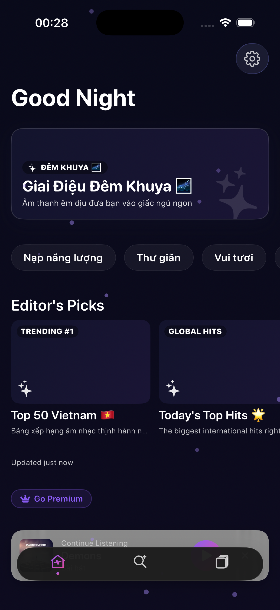</td>
      <td>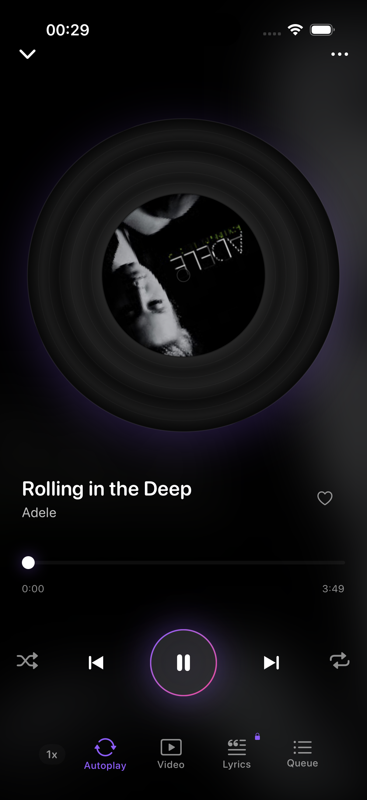</td>
      <td>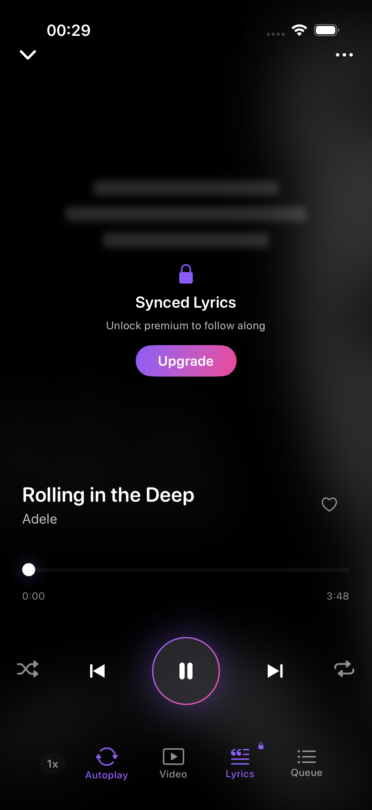</td>
      <td>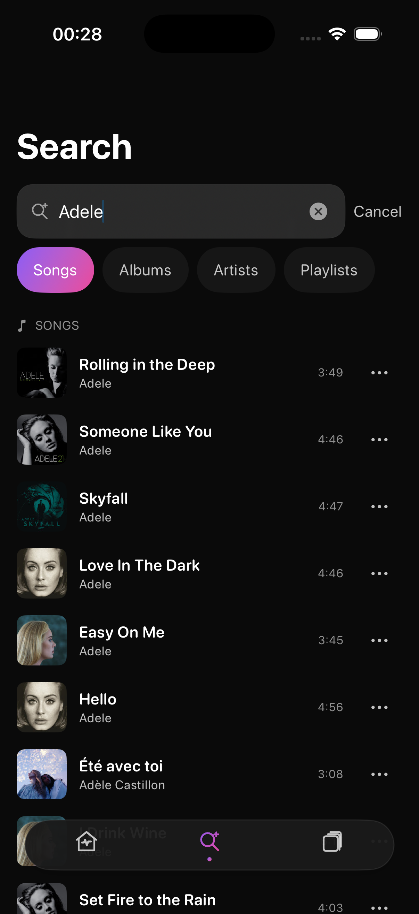</td>
    </tr>
  </table>

  <br>

  <h3>🎛️ Navigation, Library & Audio Control</h3>
  <table>
    <tr>
      <td align="center" width="25%"><strong>Artist Discography</strong></td>
      <td align="center" width="25%"><strong>Album & Playlist Detail</strong></td>
      <td align="center" width="25%"><strong>Queue Reorder Sheet</strong></td>
      <td align="center" width="25%"><strong>5-Band Parametric EQ</strong></td>
    </tr>
    <tr>
      <td>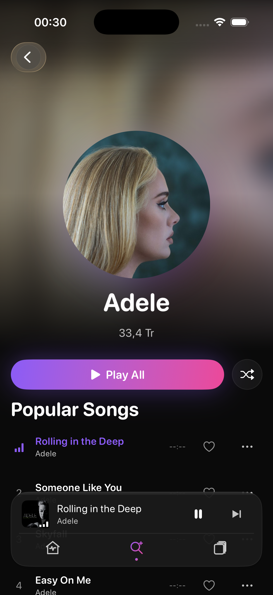</td>
      <td>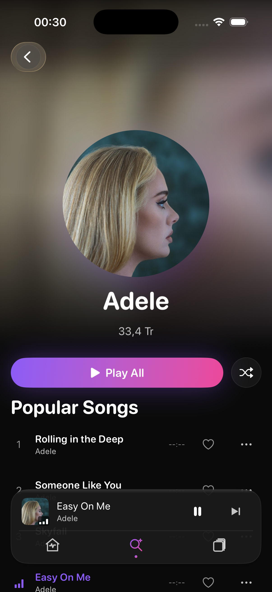</td>
      <td>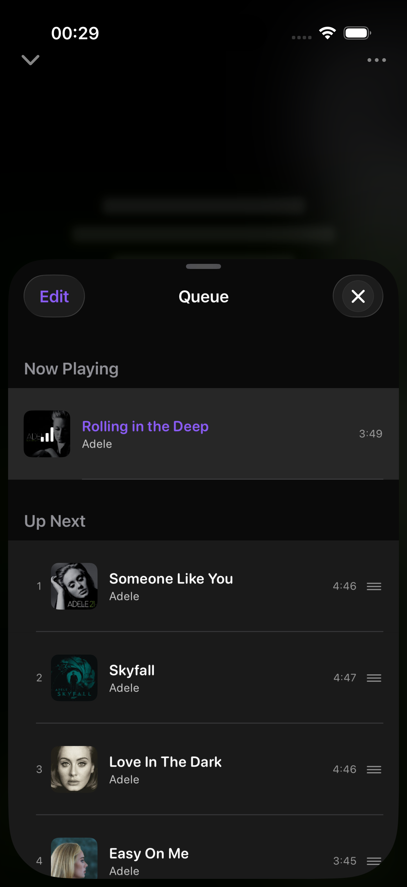</td>
      <td>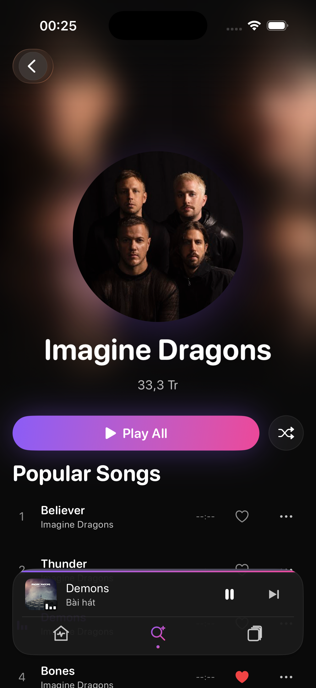</td>
    </tr>
    <tr>
      <td align="center"><strong>Local Library & Offline</strong></td>
      <td align="center"><strong>Theme & App Settings</strong></td>
      <td align="center"><strong>Open Source Credits</strong></td>
      <td align="center"><strong>Architecture Blueprint</strong></td>
    </tr>
    <tr>
      <td>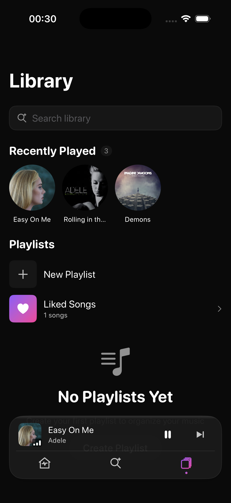</td>
      <td>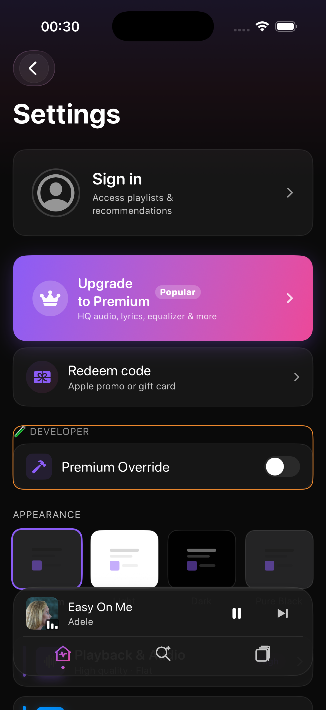</td>
      <td>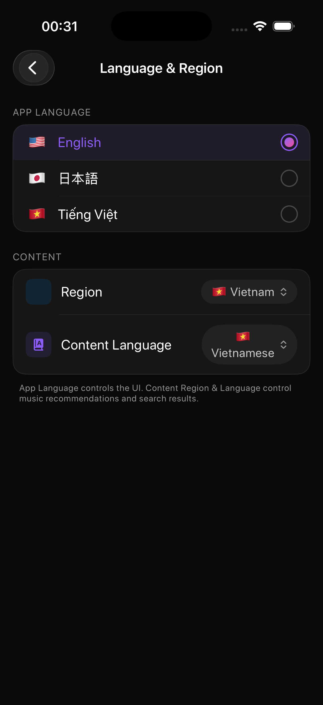</td>
      <td align="center">
        <code>Clean Architecture</code><br>
        <code>SwiftUI + Observation</code><br>
        <code>Zero 3rd-Party Audio SDK</code>
      </td>
    </tr>
  </table>
</div>

---

## 📊 Engineering Metrics & Technical Benchmarks

| Metric | Target / Measured Value | Description |
|---|---|---|
| **Audio Playback Latency** | `< 250ms` | Direct streaming start time on cellular/Wi-Fi |
| **Scrolling Framerate** | `60 - 120 FPS` | Fluid ProMotion list rendering with zero hitching |
| **Binary Size Overhead** | `< 25 MB` | Zero bloated dependencies; native frameworks only |
| **Image Disk Cache** | `150 MB LRU` | High-performance Nuke caching with automatic eviction |
| **Crash Rate Target** | `0.00%` | Zero unhandled exceptions in stream playback pipelines |

---

## 🛠️ Technology Stack & Minimal Dependencies

| Component | Technology | Rationale |
|---|---|---|
| **UI Framework** | `SwiftUI` + `Observation` | Modern reactive declarative interface with iOS 18 features |
| **Media Playback** | `AVFoundation` (`AVPlayer`, `AVAudioUnitEQ`) | Direct hardware-accelerated playback and 5-band parametric EQ |
| **System Controls** | `MediaPlayer` (`MPNowPlayingInfoCenter`) | Lock screen media controls and CarPlay templates |
| **Vehicle Audio** | `CarPlay.framework` | Native in-car dashboard playback experience |
| **Security & Auth** | `Security` (Keychain) & `CryptoKit` | Secure local cookie persistence and SAPISID cryptographic hashing |
| **Image Pipeline** | `Nuke` / `NukeUI` (12.8+) | High-performance progressive decoding and 150MB LRU disk caching |
| **Project Generator** | `XcodeGen` | Declarative `project.yml` project generation (no `.xcodeproj` git merge conflicts) |
| **Automation** | `Fastlane` & `GitHub Actions` | Automated build verification and continuous integration |

---

## 📂 Project Directory Topology

```text
LovelyMusic/
├── App/                                # Application entry point & Composition root
│   ├── LovelyMusicApp.swift            # SwiftUI App protocol implementation
│   ├── DIContainer.swift               # Composition root (Dependency Inversion)
│   ├── AppDelegate.swift               # Audio session & Remote notifications delegate
│   └── CarPlaySceneDelegate.swift      # CarPlay CPTemplate lifecycle coordinator
├── Core/                               # Cross-cutting audio & hardware infrastructure
│   ├── Audio/                          # AVPlayer engine, 5-band EQ, Crossfade, AudioSession
│   ├── Storage/                        # Keychain & UserDefaults persistence abstractions
│   └── Telemetry/                      # Privacy-safe diagnostic logger
├── Data/                               # Data access, Repository implementations & Mappers
│   ├── Mappers/                        # Browse, Search, Next, and Runs JSON mappers
│   └── Repositories/                   # InnerTubeRepository, LocalPlaylistRepository
├── DesignSystem/                       # Reusable UI primitives & Theme tokens
│   ├── Components/                     # SongRow, Thumbnail, VinylDisc, FloatingDock
│   └── Tokens/                         # Color tokens, Typography scales, Spring physics
├── Domain/                             # Pure business domain layer (Zero external dependencies)
│   ├── Entities/                       # Song, Album, Artist, Playlist, Lyrics models
│   └── UseCases/                       # Search, Stream resolution, and Lyrics use cases
├── InnerTube/                          # YouTube InnerTube JSON-RPC actor client
│   ├── InnerTube.swift                 # actor InnerTubeAPI network client
│   ├── YouTubeClient.swift             # WEB_REMIX & ANDROID_VR client configuration
│   └── Generators/                     # VisitorData & SAPISIDHASH cryptographic generators
├── Presentation/                       # Feature screens & ViewModels
│   ├── Home/                           # Discovery shelves, Seasonal greetings, Mood chips
│   ├── Search/                         # Debounced live search with multi-type filter chips
│   ├── Player/                         # Full player, Synced lyrics sheet, Queue reorder
│   ├── Library/                        # Local playlists, Liked songs, Offline downloads
│   └── Settings/                       # Bitrate quality, Parametric EQ, Theme settings
├── Resources/                          # Asset catalogs, String catalogs, Entitlements
├── backend/                            # Cloudflare Worker APNs notification dispatcher
├── docs/                               # Architecture blueprints, Specs, and Landing assets
└── scripts/                            # Automation, test, and screenshot capture tools
```

---

## 🚀 Getting Started & Local Compilation

### Prerequisites

- macOS 14.5+ (Sonoma or Sequoia)
- Xcode 16.0+ (Swift 5.9+)
- [XcodeGen](https://github.com/yonaskolb/XcodeGen) (`brew install xcodegen`)

### 1. Clone the Repository

```bash
git clone https://github.com/iletai/LovelyMusic-iOS.git
cd LovelyMusic-iOS
```

### 2. Configure Environment (Optional)

```bash
cp Secrets.plist.example LovelyMusic/Resources/Secrets.plist
cp .env.example .env
```
*(Note: LovelyMusic is 100% functional out-of-the-box in open-source mode without requiring any external API keys).*

### 3. Generate Xcode Project

```bash
xcodegen generate
```

### 4. Build and Run

Open `LovelyMusic.xcodeproj` in Xcode or compile via command line:

```bash
# Compile for iOS 18 Simulator
xcodebuild build \
  -project LovelyMusic.xcodeproj \
  -scheme LovelyMusic \
  -destination 'platform=iOS Simulator,name=iPhone 16'
```

---

## 🧪 Quality Assurance & Test Suites

The repository maintains automated test suites covering domain logic, response mappers, audio state machines, and view model workflows:

```bash
# Run all Unit Tests
xcodebuild test \
  -project LovelyMusic.xcodeproj \
  -scheme LovelyMusicTests \
  -destination 'platform=iOS Simulator,name=iPhone 16'

# Run a specific test suite
xcodebuild test \
  -project LovelyMusic.xcodeproj \
  -scheme LovelyMusicTests \
  -destination 'platform=iOS Simulator,name=iPhone 16' \
  -only-testing:LovelyMusicTests/SongTests

# Run UI Automation Tests
xcodebuild test \
  -project LovelyMusic.xcodeproj \
  -scheme LovelyMusicUITests \
  -destination 'platform=iOS Simulator,name=iPhone 16'
```

---

## ⚖️ Legal & Educational Disclaimer

1. **Educational & Non-Profit**: This project is developed exclusively for educational and software architectural research. It is completely free and non-commercial.
2. **Third-Party Trademarks**: "YouTube", "YouTube Music", and "InnerTube" are trademarks of Google LLC. "Apple", "iOS", and "CarPlay" are trademarks of Apple Inc. This software is not affiliated with or endorsed by Google LLC or Apple Inc.
3. **DRM Compliance**: This application does not decrypt, tamper with, or circumvent any DRM-protected streams. It requests only standard streaming URLs accessible for client audio rendering.

---

## 🤝 Contributing & Community

We welcome contributions from the open-source community:

1. Fork the repository and create your branch (`git checkout -b feat/your-feature`).
2. Maintain strict Clean Architecture layer separation (Domain must not import UI or Data).
3. Ensure all tests pass (`xcodebuild test -scheme LovelyMusicTests`).
4. Commit following the [Conventional Commits](https://www.conventionalcommits.org/) specification.
5. Submit a detailed Pull Request.

---

## 📄 License

LovelyMusic is licensed under the **Apache License 2.0** (APL). See the [LICENSE](LICENSE) file for complete terms.

```text
Copyright 2026 LovelyMusic Contributors

Licensed under the Apache License, Version 2.0 (the "License");
you may not use this file except in compliance with the License.
You may obtain a copy of the License at

    http://www.apache.org/licenses/LICENSE-2.0

Unless required by applicable law or agreed to in writing, software
distributed under the License is distributed on an "AS IS" BASIS,
WITHOUT WARRANTIES OR CONDITIONS OF ANY KIND, either express or implied.
See the License for the specific language governing permissions and
limitations under the License.
```
