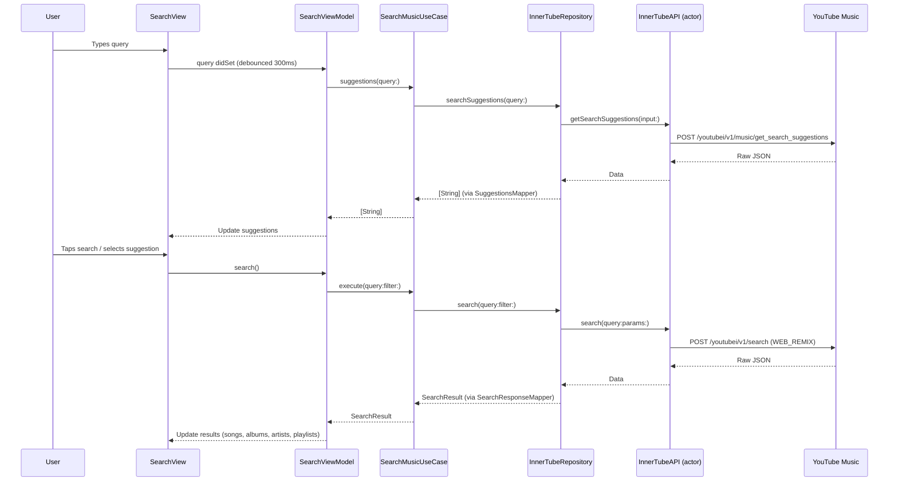
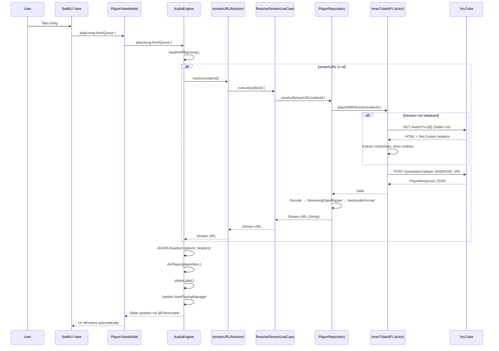
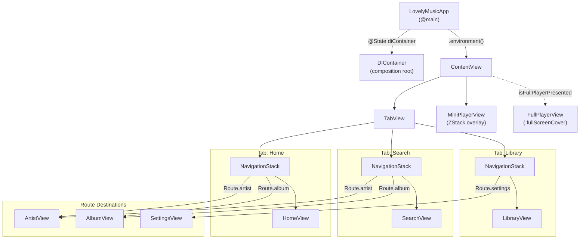

# LovelyMusic — Architecture

## 1. Project Overview

**LovelyMusic** is an open-source iOS music streaming application built with **SwiftUI** and powered by YouTube's private **InnerTube API**. It lets users search, browse, and stream music from YouTube Music without ads, with full background playback and lock-screen controls.

- **Platform:** iOS 18+
- **Language:** Swift 5.9
- **UI Framework:** SwiftUI with `@Observable` (Observation framework)
- **Build System:** [XcodeGen](https://github.com/yonaskolb/XcodeGen) via `project.yml`
- **License:** GNU General Public License v3.0 (GPLv3)
- **Minimum Xcode:** 16.0

## 2. Project Structure

```text
LovelyMusic/
├── project.yml                          # XcodeGen project specification
├── LICENSE                              # GPLv3
├── README.md
├── docs/
│   ├── ARCHITECTURE.md                  # ← You are here
│   ├── FEATURES.md
│   ├── ROADMAP.md
│   └── TECHSTACK.md
├── LovelyMusic/
│   ├── App/
│   │   ├── LovelyMusicApp.swift         # @main entry point, wires DIContainer into Environment
│   │   ├── AppDelegate.swift            # Configures AVAudioSession for .playback category
│   │   └── DIContainer.swift            # Dependency Injection: creates all layers, injects into views
│   ├── InnerTube/                       # Network layer — YouTube InnerTube API client
│   │   ├── InnerTube.swift              # actor InnerTubeAPI — thread-safe HTTP + session management
│   │   ├── YouTubeClient.swift          # Client configs (WEB_REMIX, IOS, ANDROID_VR, etc.)
│   │   ├── Models/
│   │   │   ├── Context.swift            # InnerTubeContext (client name/version/locale)
│   │   │   ├── YouTubeLocale.swift       # Region (gl) + language (hl) pair
│   │   │   ├── Body/                    # Request body models
│   │   │   │   ├── SearchBody.swift
│   │   │   │   ├── PlayerBody.swift
│   │   │   │   ├── BrowseBody.swift
│   │   │   │   ├── NextBody.swift
│   │   │   │   ├── GetQueueBody.swift
│   │   │   │   └── GetSearchSuggestionsBody.swift
│   │   │   ├── Response/                # Response models (raw YouTube JSON shapes)
│   │   │   │   ├── SearchResponse.swift
│   │   │   │   ├── PlayerResponse.swift
│   │   │   │   ├── BrowseResponse.swift
│   │   │   │   ├── NextResponse.swift
│   │   │   │   └── GetSearchSuggestionsResponse.swift
│   │   │   └── Renderers/              # Shared YouTube renderer models
│   │   │       ├── MusicResponsiveListItemRenderer.swift
│   │   │       └── SharedRenderers.swift
│   │   └── Utils/
│   │       └── CookieUtils.swift        # Cookie string parser
│   ├── Data/                            # Data layer — repository implementations + mappers
│   │   ├── Repositories/
│   │   │   ├── InnerTubeRepository.swift # Implements InnerTubeRepositoryProtocol
│   │   │   ├── PlayerRepository.swift    # Implements PlayerRepositoryProtocol (ANDROID_VR)
│   │   │   └── LocalPlaylistRepository.swift # Implements PlaylistRepositoryProtocol (UserDefaults)
│   │   ├── Mappers/
│   │   │   ├── SearchResponseMapper.swift   # Raw JSON → SearchResult, Song, Album, Artist
│   │   │   ├── BrowseResponseMapper.swift   # Raw JSON → MusicSection, Artist, Album, Playlist
│   │   │   ├── NextResponseMapper.swift     # Raw JSON → [Song] (up-next queue)
│   │   │   ├── StreamingDataMapper.swift    # Raw JSON → StreamingData + StreamFormat
│   │   │   └── SuggestionsMapper.swift      # Raw JSON → [String] suggestions
│   │   └── LrcLib/
│   │       └── LrcLibService.swift      # Implements LyricsRepositoryProtocol via lrclib.net API
│   ├── Domain/                          # Domain layer — entities, protocols, use cases
│   │   ├── Entities/
│   │   │   ├── Song.swift               # Core music entity (id, title, artistName, streamURL…)
│   │   │   ├── Album.swift              # Album with songs collection
│   │   │   ├── Artist.swift             # Artist with songs, albums, singles
│   │   │   ├── Playlist.swift           # Playlist (local or remote) with songs
│   │   │   ├── StreamingData.swift      # Streaming formats + bestAudioFormat selector
│   │   │   ├── SearchResult.swift       # Composite search result + SearchFilter enum
│   │   │   └── PlayerState.swift        # Enum: idle | loading | playing | paused | buffering | error
│   │   ├── Protocols/
│   │   │   ├── InnerTubeRepositoryProtocol.swift  # search, browse, getArtist, getAlbum…
│   │   │   ├── PlayerRepositoryProtocol.swift     # resolveStreamURL(videoId:)
│   │   │   ├── PlaylistRepositoryProtocol.swift   # CRUD playlists + history
│   │   │   └── LyricsRepositoryProtocol.swift     # getLyrics(title:artist:duration:)
│   │   └── UseCases/
│   │       ├── SearchMusicUseCase.swift        # Search + suggestions + continuation
│   │       ├── BrowseHomeUseCase.swift         # Fetch home page sections
│   │       ├── GetArtistUseCase.swift          # Fetch artist details
│   │       ├── GetAlbumUseCase.swift           # Fetch album details
│   │       ├── GetPlaylistUseCase.swift        # Fetch playlist details
│   │       ├── ResolveStreamUseCase.swift      # Resolve video ID → stream URL
│   │       ├── GetLyricsUseCase.swift          # Fetch synced/plain lyrics
│   │       └── ManagePlaylistUseCase.swift     # CRUD local playlists + history
│   ├── Presentation/                    # UI layer — views and view models
│   │   ├── Navigation/
│   │   │   ├── ContentView.swift        # Root: TabView + NavigationStack + MiniPlayer
│   │   │   └── Route.swift              # Route enum for type-safe navigation
│   │   ├── Home/
│   │   │   ├── HomeView.swift
│   │   │   └── HomeViewModel.swift
│   │   ├── Search/
│   │   │   ├── SearchView.swift
│   │   │   └── SearchViewModel.swift
│   │   ├── Player/
│   │   │   ├── PlayerViewModel.swift    # Central playback VM, @MainActor @Observable
│   │   │   ├── FullPlayerView.swift
│   │   │   ├── MiniPlayerView.swift
│   │   │   └── Components/
│   │   │       └── LyricsView.swift
│   │   ├── Album/
│   │   │   ├── AlbumView.swift
│   │   │   └── AlbumViewModel.swift
│   │   ├── Artist/
│   │   │   ├── ArtistView.swift
│   │   │   └── ArtistViewModel.swift
│   │   ├── Library/
│   │   │   ├── LibraryView.swift
│   │   │   └── LibraryViewModel.swift
│   │   ├── Settings/
│   │   │   ├── SettingsView.swift
│   │   │   └── SettingsViewModel.swift
│   │   └── Auth/
│   │       └── YouTubeLoginView.swift
│   ├── Core/                            # Shared infrastructure
│   │   ├── Audio/
│   │   │   ├── AudioEngine.swift        # @MainActor @Observable — AVPlayer wrapper
│   │   │   ├── AudioSessionManager.swift # Static audio session helpers
│   │   │   ├── NowPlayingManager.swift   # MPNowPlayingInfoCenter integration
│   │   │   └── RemoteCommandManager.swift # MPRemoteCommandCenter integration
│   │   ├── Auth/
│   │   │   └── YouTubeAuthManager.swift  # Keychain-backed YouTube cookie management
│   │   └── Extensions/
│   │       ├── Color+Theme.swift         # Color(hex:) initializer
│   │       ├── URL+Extensions.swift      # URL.queryParameters helper
│   │       └── View+Extensions.swift     # Conditional modifiers + hideKeyboard()
│   ├── DesignSystem/                    # Reusable UI primitives
│   │   ├── Theme.swift                  # Colors, Typography, Spacing, CornerRadius, Shadows
│   │   ├── Components/
│   │   │   ├── SongRowView.swift        # Standard song list row
│   │   │   ├── AsyncThumbnail.swift     # AsyncImage with shimmer + placeholder
│   │   │   ├── GlassmorphicCard.swift   # .ultraThinMaterial card
│   │   │   ├── ShimmerView.swift        # Loading shimmer animation
│   │   │   ├── EmptyStateView.swift     # Empty content placeholder
│   │   │   └── ErrorStateView.swift     # Error display with retry
│   │   ├── Modifiers/
│   │   │   ├── GlassModifier.swift      # .glass() view modifier
│   │   │   └── BouncyButtonStyle.swift  # .bouncy button style (spring animation)
│   │   └── Animations/
│   │       ├── MusicWaveAnimation.swift  # Animated equalizer bars
│   │       ├── ExpandTransition.swift    # Scale + fade transition
│   │       └── ParallaxEffect.swift      # Parallax scroll modifier
│   └── Resources/
│       ├── Info.plist
│       └── Assets.xcassets/
├── LovelyMusicTests/                    # Unit test target
└── LovelyMusicUITests/                  # UI test target
```

## 3. Architecture Pattern

LovelyMusic follows **Clean Architecture** with four distinct layers. Dependencies flow strictly inward — outer layers depend on inner layers, never the reverse.

```text
┌──────────────────────────────────────────────────────────┐
│                    Presentation                          │
│        (SwiftUI Views + @Observable ViewModels)          │
├──────────────────────────────────────────────────────────┤
│                      Domain                              │
│       (Entities + Protocols + Use Cases)                 │
├──────────────────────────────────────────────────────────┤
│                       Data                               │
│      (Repository Impls + Mappers + LrcLib)               │
├──────────────────────────────────────────────────────────┤
│                    InnerTube                              │
│       (actor InnerTubeAPI + YouTubeClient configs)       │
└──────────────────────────────────────────────────────────┘
```

### Dependency Rule

- **Domain** knows nothing about Data, InnerTube, or Presentation. It only defines protocols and entities.
- **Data** implements Domain protocols and depends on InnerTube for network calls.
- **Presentation** depends on Domain (use cases and entities) but never touches Data or InnerTube directly.
- **InnerTube** is a standalone network layer with no knowledge of the layers above it.

### Dependency Injection via DIContainer

`DIContainer` is the composition root. It is `@MainActor @Observable` and lives as a SwiftUI `@State` in the `@main` app struct. It:

1. Creates `InnerTubeAPI` (actor), `AudioEngine`, and `YouTubeAuthManager`
2. Wires repositories: `InnerTubeRepository`, `PlayerRepository`, `LocalPlaylistRepository`, `LrcLibService`
3. Wires use cases by injecting repository protocol references
4. Creates the singleton `PlayerViewModel` (shared across the entire app)
5. Injects `streamURLResolver` closure and `streamHeaders` into `AudioEngine`
6. Propagates locale/auth settings into `InnerTubeAPI` via `Task {}`

```swift
// LovelyMusicApp.swift
@main
struct LovelyMusicApp: App {
    @State private var diContainer = DIContainer()

    var body: some Scene {
        WindowGroup {
            ContentView()
                .environment(diContainer)
                .environment(diContainer.playerViewModel)
                .environment(diContainer.audioEngine)
        }
    }
}
```

ViewModels that are not shared (e.g., `HomeViewModel`, `SearchViewModel`) are created inline by the view that owns them, receiving use cases from the `DIContainer` environment.

## 4. Layer Details

### 4.1 InnerTube Layer

The InnerTube layer encapsulates all YouTube Music API communication.

#### actor InnerTubeAPI

`InnerTubeAPI` is a Swift `actor`, providing thread-safe access to mutable state (locale, cookies, visitor data, session state). Key methods:

| Method | Client | Description |
|---|---|---|
| `search(query:params:continuation:)` | `WEB_REMIX` | Search YouTube Music |
| `player(videoId:playlistId:)` | `IOS` | Get player data (legacy path) |
| `browse(browseId:params:continuation:)` | `WEB_REMIX` | Browse home, artists, albums, playlists |
| `next(videoId:playlistId:…)` | `WEB_REMIX` | Get up-next/related tracks |
| `getSearchSuggestions(input:)` | `WEB_REMIX` | Autocomplete suggestions |
| `getQueue(videoIds:playlistId:)` | `WEB_REMIX` | Retrieve queue data |
| `playerWithSession(videoId:playlistId:)` | `ANDROID_VR` | **Primary stream resolver** — session-based |

#### YouTubeClient Configurations

Static presets define client identity sent in every request:

| Preset | Client Name | Client ID | Use Case |
|---|---|---|---|
| `.webRemix` | `WEB_REMIX` | 67 | Search, browse, next, suggestions |
| `.ios` | `IOS` | 5 | Legacy player requests |
| `.androidVR` | `ANDROID_VR` | 28 | **Primary stream resolution** |
| `.tvhtml5` | `TVHTML5_SIMPLY_EMBEDDED_PLAYER` | 85 | Fallback client |
| `.androidMusic` | `ANDROID_MUSIC` | 21 | Alternative client |
| `.web` | `WEB` | 1 | Generic web client |

#### ANDROID_VR Session Approach

The `playerWithSession()` method is the primary stream resolver. It works by:

1. **Session initialization** — visits `youtube.com/watch?v={id}` with a Safari user-agent to obtain session cookies (CONSENT, VISITOR_INFO1_LIVE, etc.) and extracts `visitorData` from the page HTML
2. **Player request** — sends a `/youtubei/v1/player` POST with `ANDROID_VR` client identity (Oculus Quest 3, Android 12L), including session cookies and visitor data in headers
3. **Session reuse** — the session is initialized once and reused for subsequent requests; `resetSession()` forces re-initialization on failure

### 4.2 Data Layer

#### Repositories

| Repository | Protocol | Backend | Description |
|---|---|---|---|
| `InnerTubeRepository` | `InnerTubeRepositoryProtocol` | `InnerTubeAPI` | Search, browse, artist/album/playlist fetching. Delegates to Mappers for JSON → Domain translation. |
| `PlayerRepository` | `PlayerRepositoryProtocol` | `InnerTubeAPI` | Resolves video ID to stream URL via `playerWithSession()`. Includes automatic retry with session reset on playability errors. |
| `LocalPlaylistRepository` | `PlaylistRepositoryProtocol` | `UserDefaults` | CRUD for local playlists and recently-played history. Uses `CodablePlaylist` wrapper for persistence. Caps history at 50 items. |

#### Mappers

Mappers are stateless `enum` types that transform raw InnerTube JSON responses into Domain entities:

- **`SearchResponseMapper`** — parses `SearchResponse` into `SearchResult` (songs, albums, artists, playlists). Detects content category from shelf titles. Handles continuation tokens.
- **`BrowseResponseMapper`** — parses `BrowseResponse` for home sections (carousels → `MusicSection`), artist pages, album pages, and playlist pages.
- **`NextResponseMapper`** — parses `NextResponse` into `[Song]` from the up-next/playlist panel.
- **`StreamingDataMapper`** — maps `PlayerResponse.StreamingDataResponse` into `StreamingData` + `[StreamFormat]`.
- **`SuggestionsMapper`** — extracts suggestion strings from `GetSearchSuggestionsResponse`.

#### LrcLibService

Implements `LyricsRepositoryProtocol` by fetching synchronized lyrics from [lrclib.net](https://lrclib.net). Supports both synced (LRC format with timestamps) and plain lyrics as fallback.

### 4.3 Domain Layer

The Domain layer is framework-agnostic and contains no imports of UIKit, SwiftUI, or AVFoundation.

#### Entities

| Entity | Key Fields | Notes |
|---|---|---|
| `Song` | `id`, `title`, `artistName`, `artistId?`, `albumName?`, `albumId?`, `duration?`, `thumbnailURL?`, `streamURL?` | `Codable`, `Identifiable`, `Hashable`. `streamURL` is `var` — populated lazily. |
| `Album` | `id`, `title`, `artistName`, `artistId?`, `year?`, `thumbnailURL?`, `songs` | Contains computed `totalDuration`. |
| `Artist` | `id`, `name`, `thumbnailURL?`, `subscriberCount?`, `songs`, `albums`, `singles` | Aggregates all artist content. |
| `Playlist` | `id`, `title`, `thumbnailURL?`, `songCount?`, `songs`, `isLocal` | `isLocal` distinguishes local vs YouTube playlists. |
| `StreamingData` | `formats`, `adaptiveFormats` | `bestAudioFormat` filters for `audio/mp4` only and respects user quality setting. |
| `SearchResult` | `songs`, `albums`, `artists`, `playlists`, `continuation?` | Composite result with pagination token. |
| `PlayerState` | enum: `idle`, `loading`, `playing`, `paused`, `buffering`, `error(String)` | `isActive` computed property. |
| `SearchFilter` | enum with base64-encoded InnerTube params | Filters: Songs, Albums, Artists, Playlists. |
| `MusicSection` | `title`, `items: [MusicSectionItem]` | Home page carousel section. |
| `MusicSectionItem` | enum: `.song`, `.album`, `.artist`, `.playlist` | Polymorphic section content. |

#### Protocols

```swift
protocol InnerTubeRepositoryProtocol {
    func search(query:filter:) async throws -> SearchResult
    func searchContinuation(token:) async throws -> SearchResult
    func searchSuggestions(query:) async throws -> [String]
    func getStreamingData(videoId:) async throws -> StreamingData
    func browseHome() async throws -> [MusicSection]
    func getArtist(browseId:) async throws -> Artist
    func getAlbum(browseId:) async throws -> Album
    func getPlaylist(playlistId:) async throws -> Playlist
    func getNext(videoId:playlistId:) async throws -> [Song]
}

protocol PlayerRepositoryProtocol {
    func resolveStreamURL(videoId:) async throws -> String
}

protocol PlaylistRepositoryProtocol {
    func getAllPlaylists() async throws -> [Playlist]
    func createPlaylist(title:) async throws -> Playlist
    func deletePlaylist(id:) async throws
    func addSongToPlaylist(song:playlistId:) async throws
    func removeSongFromPlaylist(songId:playlistId:) async throws
    func getRecentlyPlayed() async throws -> [Song]
    func addToHistory(song:) async throws
}

protocol LyricsRepositoryProtocol {
    func getLyrics(title:artist:duration:) async throws -> SyncedLyrics?
}
```

#### Use Cases

Each use case is a `final class` with a single repository dependency injected via initializer:

| Use Case | Repository | Primary Method |
|---|---|---|
| `SearchMusicUseCase` | `InnerTubeRepositoryProtocol` | `execute(query:filter:)`, `continueSearch(token:)`, `suggestions(query:)` |
| `BrowseHomeUseCase` | `InnerTubeRepositoryProtocol` | `execute()` → `[MusicSection]` |
| `GetArtistUseCase` | `InnerTubeRepositoryProtocol` | `execute(browseId:)` → `Artist` |
| `GetAlbumUseCase` | `InnerTubeRepositoryProtocol` | `execute(browseId:)` → `Album` |
| `GetPlaylistUseCase` | `InnerTubeRepositoryProtocol` | `execute(playlistId:)` → `Playlist` |
| `ResolveStreamUseCase` | `PlayerRepositoryProtocol` | `execute(videoId:)` → `String` (stream URL) |
| `GetLyricsUseCase` | `LyricsRepositoryProtocol` | `execute(title:artist:duration:)` → `SyncedLyrics?` |
| `ManagePlaylistUseCase` | `PlaylistRepositoryProtocol` | `getAllPlaylists()`, `createPlaylist(title:)`, `addSong(_:to:)`, `getRecentlyPlayed()`, etc. |

### 4.4 Presentation Layer

#### ViewModels

All ViewModels use the `@Observable` macro (iOS 17+). The `PlayerViewModel` additionally uses `@MainActor` since it drives UI-bound audio state.

| ViewModel | Scope | Key Responsibilities |
|---|---|---|
| `PlayerViewModel` | **Singleton** (created in `DIContainer`, injected via `.environment()`) | Playback control, lyrics loading, shuffle/repeat state. Delegates to `AudioEngine`. |
| `HomeViewModel` | Per-view | Fetches home sections via `BrowseHomeUseCase`. |
| `SearchViewModel` | Per-view | Debounced search (300ms), suggestions, pagination via continuation tokens. |
| `AlbumViewModel` | Per-view | Fetches album details. |
| `ArtistViewModel` | Per-view | Fetches artist details. |
| `LibraryViewModel` | Per-view | Local playlist CRUD + recently played. |
| `SettingsViewModel` | Per-view | Region/language settings, audio quality, auth state. |

#### Navigation

Navigation uses a `TabView` + `NavigationStack` + type-safe `Route` enum pattern:

```swift
enum Route: Hashable {
    case home
    case search
    case artist(browseId: String)
    case album(browseId: String)
    case playlist(playlistId: String)
    case player
    case settings
}

enum AppTab: Hashable {
    case home, search, library
}
```

`ContentView` is the root view. It provides:

- A `TabView` with three tabs (Home, Search, Library), each wrapped in its own `NavigationStack`
- A shared `MiniPlayerView` overlay at the bottom (visible when a track is loaded)
- A `.fullScreenCover` for `FullPlayerView` (toggled via `PlayerViewModel.isFullPlayerPresented`)
- A `routeDestination(_:)` function that maps `Route` → destination view

### 4.5 Core Layer

#### AudioEngine

`AudioEngine` is `@MainActor @Observable final class` — the central audio playback controller.

**Key responsibilities:**

- Wraps `AVPlayer` for audio playback
- Manages play queue with shuffle and repeat (off/all/one)
- Lazy stream resolution via `streamURLResolver` closure (injected by `DIContainer`)
- Creates `AVURLAsset` with custom HTTP headers (required for googlevideo.com URLs)
- Periodic time observation (0.5s interval) for progress updates
- Track-end handling (repeat/next logic)
- Audio interruption handling (phone calls, other apps)
- Route change handling (headphones disconnected → pause)

**Supporting managers:**

| Manager | Responsibility |
|---|---|
| `AudioSessionManager` | Static helpers to configure `AVAudioSession` for `.playback` category |
| `NowPlayingManager` | Updates `MPNowPlayingInfoCenter` with current track metadata and artwork |
| `RemoteCommandManager` | Registers `MPRemoteCommandCenter` handlers (play, pause, next, previous, seek, skip forward/backward) |

#### YouTubeAuthManager

`@Observable final class` that manages YouTube authentication cookies:

- Stores/retrieves auth cookies (SAPISID, SID, HSID, etc.) in iOS Keychain
- Generates `SAPISIDHASH` authorization headers using SHA-1
- Provides `cookieHeaderString()` for authenticated API requests
- Supports login/logout flow

### 4.6 DesignSystem

A self-contained design system providing consistent UI primitives.

#### Theme

`Theme` is a caseless `enum` with nested namespaces:

- **`Colors`** — semantic colors (primary, backgrounds, labels, player gradients)
- **`Typography`** — font presets (largeTitle, title, headline, body, caption)
- **`Spacing`** — spacing scale (xs=4, sm=8, md=12, lg=16, xl=24, xxl=32)
- **`CornerRadius`** — radius presets (small=8, medium=12, large=16, extraLarge=24)
- **`Shadows`** — `ShadowStyle` presets (small, medium, large)

#### Components

| Component | Purpose |
|---|---|
| `SongRowView` | Standard song list item with thumbnail, title, artist, duration, playing indicator |
| `AsyncThumbnail` | `AsyncImage` wrapper with shimmer loading state and music-note placeholder |
| `GlassmorphicCard` | `.ultraThinMaterial` background card with shadow |
| `ShimmerView` | Animated loading shimmer effect |
| `EmptyStateView` | Icon + title + message for empty content |
| `ErrorStateView` | Error message with optional retry button |

#### Modifiers

| Modifier | Usage |
|---|---|
| `GlassModifier` | `.glass(cornerRadius:)` — applies `.ultraThinMaterial` background |
| `BouncyButtonStyle` | `.bouncy` — spring-animated scale + opacity on press |

#### Animations

| Animation | Description |
|---|---|
| `MusicWaveAnimation` | Animated equalizer bars (3 bars with random heights) |
| `ExpandTransition` | Scale + fade transition modifier for expand/collapse |
| `ParallaxEffect` | Parallax scroll offset modifier |

## 5. Data Flow Diagrams

### 5.1 Search Flow



### 5.2 Playback Flow



### 5.3 Navigation Flow



## 6. Concurrency Model

### actor InnerTubeAPI

All network communication goes through `InnerTubeAPI`, which is a Swift `actor`. This guarantees:

- Thread-safe mutation of `locale`, `cookie`, `visitorData`, and `sessionCookies`
- No data races when multiple ViewModels make concurrent API calls
- All access to mutable actor state is implicitly `async`

### @MainActor AudioEngine

`AudioEngine` is annotated `@MainActor` because:

- It publishes state (`isPlaying`, `currentTime`, `duration`) consumed directly by SwiftUI views
- `AVPlayer` time observers fire on the main queue
- All UI-bound state mutations occur on the main thread without explicit dispatching

### @Observable Macro (iOS 17+)

The project uses `@Observable` (from the Observation framework) instead of `ObservableObject`/`@Published`:

- **No `@Published` wrappers needed** — all stored properties are automatically tracked
- **Fine-grained observation** — SwiftUI only re-renders views that read changed properties
- **Simpler injection** — `@Observable` objects are injected via `.environment()` without needing `@EnvironmentObject`

### Task {} for Async Operations

ViewModels use `Task {}` to bridge synchronous SwiftUI callbacks to async use case calls:

```swift
// In SearchViewModel
func search() async {
    isSearching = true
    do {
        results = try await searchUseCase.execute(query: query, filter: selectedFilter)
    } catch {
        self.error = error.localizedDescription
    }
    isSearching = false
}

// Debounced suggestions with Task cancellation
private func onQueryChanged() {
    searchTask?.cancel()
    searchTask = Task {
        try? await Task.sleep(for: .milliseconds(300))
        guard !Task.isCancelled else { return }
        await fetchSuggestions()
    }
}
```

## 7. Key Technical Decisions

### Why ANDROID_VR Client?

YouTube has progressively blocked stream URL access for most InnerTube clients (`WEB`, `IOS`, `ANDROID`). The `ANDROID_VR` client (Oculus Quest 3, client ID 28) remains functional because:

- It identifies as a VR device that YouTube has not yet restricted
- Combined with session cookies obtained from a real browser visit, it returns playable `audio/mp4` streams
- The session approach (visiting `/watch?v={id}` first) provides essential cookies like `CONSENT` and `VISITOR_INFO1_LIVE`
- If the first attempt fails, the app resets the session and retries with fresh cookies

### Why audio/mp4 Only?

```swift
// StreamingData.bestAudioFormat
let compatibleFormats = adaptiveFormats
    .filter { $0.url != nil && $0.mimeType.hasPrefix("audio/mp4") }
```

`AVPlayer` (and `AVFoundation` in general) **cannot play WebM/Opus** containers natively on iOS. YouTube's adaptive formats include both `audio/mp4` (AAC) and `audio/webm` (Opus). The app filters exclusively for `audio/mp4` to ensure compatibility without requiring a custom decoder.

### Why AVURLAsset with Custom Headers?

```swift
let headers: [String: String] = [
    "User-Agent": "com.google.android.apps.youtube.vr.oculus/1.65.10 …",
    "Origin": "https://www.youtube.com",
    "Referer": "https://www.youtube.com/"
]
let asset = AVURLAsset(url: url, options: [
    "AVURLAssetHTTPHeaderFieldsKey": headers
])
```

YouTube's `googlevideo.com` CDN validates request headers. The default iOS `AVPlayer` user-agent is rejected. By using `AVURLAsset` with the `AVURLAssetHTTPHeaderFieldsKey` option, the app injects the ANDROID_VR user-agent and proper Origin/Referer headers to match the session that originally requested the stream URL.

### Session Cookie Management Inside Actor

The `InnerTubeAPI` actor manages session cookies internally rather than using global `HTTPCookieStorage` because:

- Session state (cookies, visitor data, initialization flag) must be thread-safe
- The actor's `hasInitializedSession` flag prevents redundant browser visits
- Cookie scope is limited to YouTube-related requests, avoiding contamination of other URL sessions

### Keychain for Auth Cookies

`YouTubeAuthManager` stores authentication cookies (SAPISID, SID, HSID, etc.) in the iOS Keychain rather than `UserDefaults` because:

- Keychain data is encrypted at rest
- Cookies survive app reinstalls (useful for persistent login)
- The `SAPISIDHASH` authorization header requires the `SAPISID` cookie value, which is sensitive
